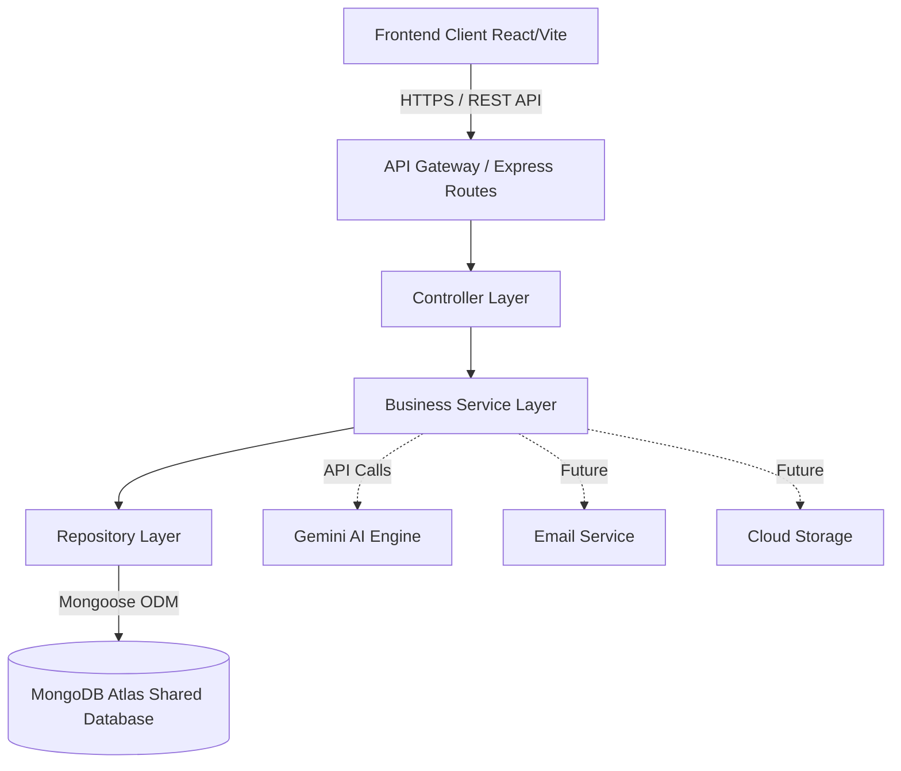
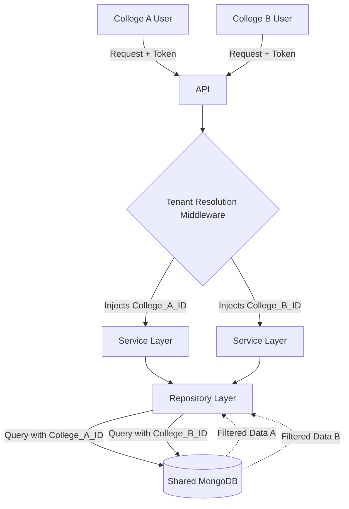
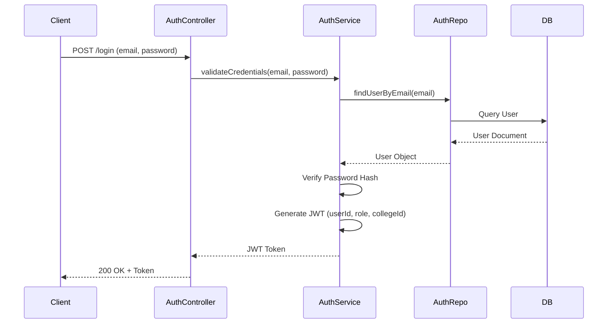
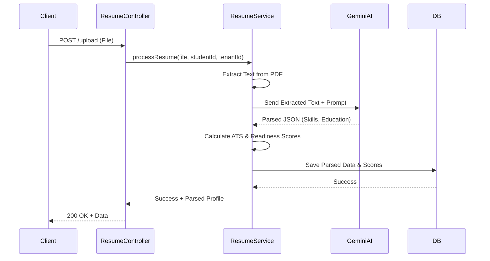
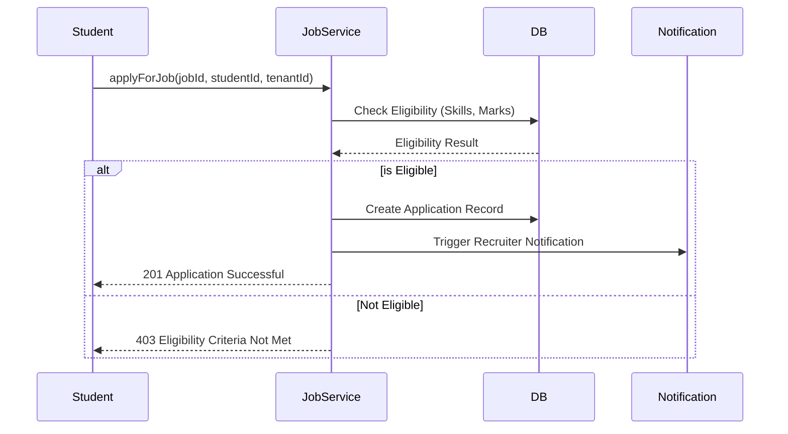
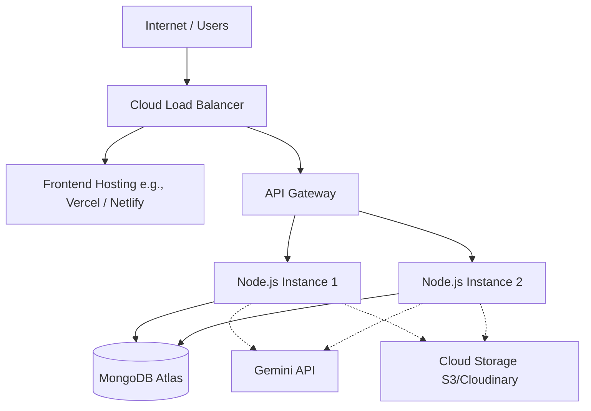

# Software Architecture Document (SAD)

## 1. Document Information

| Attribute | Details |
| :--- | :--- |
| **Project Name** | SkillSync |
| **Version** | 1.0.0 |
| **Document Purpose** | To define the comprehensive software architecture, technical decisions, and design principles for the SkillSync AI-Powered Career Intelligence Ecosystem. |
| **Intended Audience** | Senior Software Architects, Engineering Leads, Backend/Frontend Developers, DevOps Engineers. |

---

## 2. Architecture Goals

The architectural design of SkillSync is driven by the following core objectives:

- **Scalability:** Ability to handle increasing loads of students and multi-tenant college data smoothly without performance degradation.
- **Maintainability:** Clear separation of concerns ensuring that new developers can easily understand, modify, and extend the system.
- **Security:** Strict data isolation between tenants, robust role-based access control (RBAC), and secure handling of PII (Personally Identifiable Information).
- **Performance:** Optimized query times, efficient payload handling, and asynchronous processing for AI-intensive tasks.
- **Simplicity:** Avoiding over-engineering by adhering to proven, easy-to-understand patterns suitable for team scaling and seamless handoffs.
- **Modular Design:** Encapsulating business domains within specific boundaries to support independent feature evolution.

---

## 3. Architecture Style

The platform adopts a composite architectural style leveraging **Feature-Based Modular Architecture** over a traditional **Layered Architecture**, implemented as a **Multi-Tenant SaaS**.

### Key Architectural Choices:
- **Feature-Based Modular Architecture:** Code is organized by domain (e.g., Auth, Student, Job, AI) rather than by technical layer. 
- **Layered Internal Structure:** Within each module, we follow the standard layers (Controller -> Service -> Repository -> Model).
- **Repository Pattern:** Abstracts the data access logic, decoupling the business services from the underlying database driver (Mongoose).
- **REST API:** Standardized, stateless communication interface between the frontend client and the backend server.
- **Multi-Tenant SaaS (Shared Database, Separate Tenant ID):** All colleges share the same cloud infrastructure and database, but all queries enforce strict logical isolation.

### Advantages:
- **Rapid Feature Development:** Developers can work on a single feature module without context switching across the entire application.
- **Cost Efficiency:** A shared multi-tenant database is significantly cheaper to operate in the MVP phase compared to database-per-tenant.
- **Testability:** The Repository pattern allows for easy mocking of database calls during unit testing of business logic.

### Disadvantages:
- **Tenant Data Spill Risk:** A missing `tenantId` in a database query could accidentally expose data across colleges.
- **Noisy Neighbor Problem:** High resource usage by one large college could impact the performance for smaller colleges.

### Trade-offs:
- Chose **Shared Database Multi-Tenancy** over *Database-per-Tenant* for cost and simplicity, trading off absolute physical data isolation for rapid time-to-market.

---

## 4. High-Level System Architecture

The high-level architecture describes a modern decoupled web application utilizing an API-driven communication model.

---

## 5. Frontend Architecture

The frontend leverages React built with Vite, emphasizing speed, reactivity, and a component-driven approach.

- **React Application Structure:** Structured to mirror the backend feature modules.
- **Routing:** Handled by React Router, utilizing lazy loading for top-level feature routes to improve initial load times.
- **Feature Modules:** Code is organized into self-contained features (e.g., `features/resume`, `features/jobs`). Each feature contains its own components, hooks, and services.
- **Shared Components:** A centralized `components/ui` folder for generic, reusable UI elements (buttons, modals, inputs) styled with Tailwind CSS.
- **State Management Strategy:** 
  - *Local State:* Standard React hooks (`useState`, `useReducer`) for UI state.
  - *Server State:* Dedicated data-fetching library (or custom Axios hooks) for caching and synchronizing remote data.
  - *Global State:* Context API for high-level application state (e.g., Auth Session, Theme, Tenant configuration).
- **API Layer:** Centralized Axios instances configured with interceptors to handle JWT token injection and standard error unwrapping.
- **Error Handling:** Global error boundaries catch rendering crashes, while the API layer catches and formats HTTP errors into user-friendly toast notifications.

---

## 6. Backend Architecture

The backend is built on Node.js and Express.js, strictly adhering to a modular, layered structure.

- **Express Application:** The main entry point that bootstraps middleware, database connections, and registers modular routes.
- **Feature Modules:** The `src/features` directory contains domain-specific folders (e.g., `auth`, `student`).
- **Controllers:** The HTTP layer. Responsible for receiving requests, invoking the Service layer, and formatting HTTP responses. (No business logic here).
- **Services:** The Business layer. Contains the core business logic, orchestrates tasks, and enforces business rules.
- **Repositories:** The Data Access layer. Executes database queries and abstracts Mongoose syntax from the business logic.
- **Models:** Defines the Mongoose schemas and relationships.
- **Middleware:** Reusable functions for cross-cutting concerns (authentication, tenant resolution, request validation, error handling).
- **Validation:** Request payloads are validated at the route level using a schema validation library before reaching the controller.
- **Shared Utilities:** Helpers for cryptography, date formatting, and string manipulation.

---

## 7. AI Architecture

The AI module acts as an intelligent intermediary for unstructured data, heavily relying on the Gemini AI service.

### Workflow:
1. **Resume Upload:** File is received via Multer.
2. **Text Extraction:** Server extracts raw text from the uploaded PDF/DOCX file.
3. **Gemini AI:** Raw text and a strict engineering prompt are sent to the Gemini AI endpoint.
4. **Skill Extraction:** Gemini structures the unstructured text into standardized JSON containing technical and soft skills.
5. **ATS Score Generation:** AI compares extracted metrics against standard Applicant Tracking System algorithms.
6. **Skill Gap Analysis:** Service layer compares extracted skills against the target job profile requirements.
7. **Placement Readiness Calculation:** Service layer calculates an overall readiness score based on the AI analysis.
8. **Store Results:** Parsed data and calculated scores are passed to the Repository layer for persistence.

### Responsibilities:
The backend Service layer handles orchestration, while Gemini AI handles the natural language understanding and structuring.

---

## 8. Multi-Tenant Architecture

SkillSync uses a **Shared Database, Shared Schema** approach for multi-tenancy.

- **Shared Database:** All colleges, students, and jobs reside in the same MongoDB collections.
- **Tenant Isolation:** Every operational collection (Students, Jobs, Applications) includes a mandatory `collegeId` reference.
- **tenantId Strategy:** 
  - Extracted from the authenticated user's JWT payload.
  - A global middleware injects the `collegeId` into the Request object (`req.tenantId`).
  - The Service and Repository layers implicitly append `{ collegeId: req.tenantId }` to *every* database query.
- **Security:** Strictly enforced at the Repository layer to prevent accidental cross-tenant data leakage.
- **Benefits:** Highly cost-effective, easy to deploy, simple database maintenance.
- **Challenges:** Requires extreme developer discipline to ensure the `tenantId` filter is never omitted.

---

## 9. Authentication Architecture

- **JWT (JSON Web Tokens):** Used for stateless authentication. Contains user ID, role, and associated tenant (college) ID.
- **Role-Based Access Control (RBAC):** Permissions are tied strictly to roles (SuperAdmin, CollegeAdmin, PlacementOfficer, Student, Recruiter).
- **Middleware Flow:**
  1. `authenticateToken`: Verifies the JWT signature and expiration.
  2. `resolveTenant`: Ensures the user context contains a valid `collegeId`.
  3. `authorizeRole(allowedRoles)`: Validates if the user's role has permission to access the endpoint.
- **Authentication Lifecycle:** Short-lived access tokens combined with secure, HTTP-only refresh tokens (if implemented) for extended sessions.

---

## 10. Data Flow

### Student Login

### Resume Upload and AI Parsing

### Job Application

---

## 11. External Services

- **Gemini AI:** Communicates via REST APIs. Used asynchronously to process large text payloads. The system implements retry logic and timeout handling to gracefully manage API rate limits or downtime.
- **MongoDB Atlas:** The primary persistent data store, accessed via the Mongoose ODM over a secure connection string.
- **Email Service (Future):** Integrated via SMTP or standard API (e.g., SendGrid/AWS SES) for asynchronous transactional notifications.
- **Cloudinary (Future):** For secure, optimized storage of user avatars and static resume files, offloading blob storage from the primary application server.

---

## 12. Scalability Strategy

The system is designed to scale horizontally across distinct phases:

- **Current MVP (100 Students / 1 College):** Monolithic Node.js deployment. Single MongoDB Replica Set. File storage on the local server or basic cloud storage.
- **5 Colleges:** Horizontal scaling of Node.js instances behind a Load Balancer. Offload file storage entirely to a CDN/Cloud Storage.
- **100 Colleges:** Introduce Redis for caching frequent read queries (e.g., static job postings, college config). Implement asynchronous task queues (e.g., BullMQ) to offload AI parsing to worker nodes.
- **500 Colleges:** Shard the MongoDB cluster based on `collegeId` to distribute database load and improve query performance.
- **5000+ Colleges:** Evaluate transitioning high-load domain modules (like Job Matching or AI Processing) into independent Microservices.

---

## 13. Security Architecture

- **JWT:** Cryptographically signed tokens prevent tampering.
- **Password Hashing:** Passwords securely hashed using `bcrypt` with appropriate salt rounds.
- **Role Authorization:** Endpoints are protected by strict RBAC middleware.
- **Tenant Isolation:** Repository-level query filters mandate `tenantId` inclusion.
- **Input Validation:** All incoming payloads are sanitized and validated against strict schemas before processing.
- **Rate Limiting:** IP-based rate limiting on sensitive endpoints (e.g., login, AI processing) to prevent brute-force and DDoS attacks.
- **CORS:** Strictly configured to only allow requests from approved frontend origin domains.
- **Environment Variables:** Secrets are injected securely via the environment and never hardcoded.
- **Secure File Upload:** Multer restricts file types to PDF/DOCX and enforces file size limits to prevent malicious uploads.
- **Audit Logs (Future):** Tracking who accessed or modified specific critical resources.

---

## 14. Error Handling Strategy

A centralized error handling architecture ensures consistent responses and graceful degradation.

- **Application Errors:** Standardized `AppError` class extending the native Error object, including HTTP status codes and custom codes.
- **Validation Errors:** Caught by validation middleware and returned as a generic 400 Bad Request with a structured list of field-level errors.
- **Authentication Errors:** Return 401 Unauthorized or 403 Forbidden without leaking specific failure reasons (e.g., "Invalid credentials" rather than "User not found").
- **Database Errors:** Mongoose errors (e.g., duplicate keys) are intercepted at the global error handler and sanitized before reaching the user.
- **AI Errors:** If Gemini AI fails, the system logs the error and returns a 503 Service Unavailable for the AI portion, gracefully falling back to manual processes where possible.
- **Global Error Handling:** An Express error-handling middleware acts as a catch-all, formatting the response payload cleanly in production and logging stack traces in development.

---

## 15. Logging Strategy

Structured logging is utilized to facilitate robust debugging and monitoring.

- **Request Logs:** Captures method, URL, status code, and response time (e.g., using Morgan).
- **Error Logs:** Captures stack traces, payload context, and user/tenant ID for critical failures.
- **Security Logs:** Records failed login attempts, unauthorized access attempts, and abnormal rate-limit triggers.
- **Audit Logs:** Tracks state changes for sensitive entities (e.g., "Placement Officer approved Job ID: 123").
- **Performance Logs:** Tracks the execution time of external dependencies, specifically Gemini AI response times.

---

## 16. Deployment Architecture

The MVP utilizes a cloud-native deployment strategy.

---

## 17. Design Principles

- **SOLID Principles:** Followed rigorously within the backend architecture to ensure decoupling and maintainability.
- **KISS (Keep It Simple, Stupid):** Avoid premature optimization. Start with a monolith and shared database before introducing microservices.
- **DRY (Don't Repeat Yourself):** Extract common logic into shared utilities, middleware, and base repositories.
- **YAGNI (You Aren't Gonna Need It):** Only build features explicitly requested for the current version (e.g., hold off on a dedicated notification microservice until scale demands it).
- **Single Responsibility Principle:** Every file (controller, service, repository) handles one distinct part of the application lifecycle.
- **Separation of Concerns:** Clear boundary between business rules (Services) and HTTP handling (Controllers).
- **Dependency Inversion:** Higher-level modules (Controllers) depend on abstractions (Services), not direct database implementations.
- **Repository Pattern:** Centralizing database access logic.
- **Feature-Based Development:** Grouping files by domain feature to reduce cognitive load and facilitate easier team scaling.

---

## 18. Architecture Decisions (ADR)

| Decision | Reason |
| :--- | :--- |
| **Use MERN Stack** | JavaScript/TypeScript ubiquity across frontend and backend allows for full-stack developer efficiency and rapid MVP iteration. |
| **Use MongoDB** | Flexible schema design is ideal for rapidly changing application requirements and storing unstructured AI-extracted data. |
| **Use Feature Modules** | Scales better for growing teams compared to traditional layer-based folder structures. Developers own the whole feature slice. |
| **Use Repository Pattern** | Decouples business logic from Mongoose, making business logic strictly unit-testable and future-proofing against database driver changes. |
| **Use Shared Database Multi-Tenancy** | Significantly lower operational cost and complexity for the initial phase compared to maintaining separate databases per college. |
| **Use JWT Authentication** | Stateless, scalable, and allows easy embedding of `tenantId` and `role` claims without constant session database lookups. |
| **Use Gemini AI** | Offers an excellent balance of cost, context window size, and NLP capabilities required for robust resume parsing and text generation. |

---

## 19. Future Evolution

The modular architecture ensures that future system expansions can be integrated without requiring fundamental rewrites:

- **AI Interview Assistant:** Can be added as a standalone feature module (`features/interview`) hooking into the existing user profiles and job requirements.
- **Notification Service:** Currently handled synchronously; can evolve into an asynchronous worker queue utilizing an event-driven architecture when volume increases.
- **Recommendation Engine:** The repository pattern allows us to easily swap out basic MongoDB queries for a dedicated graph database or machine learning service for advanced matching.
- **Mobile App:** The existing REST API is fully decoupled from the React frontend, meaning a React Native application can be developed and integrated seamlessly without backend changes.
- **Alumni Portal:** Can be introduced as a new tenant role or separate application gateway utilizing the same core authentication and user modules.
