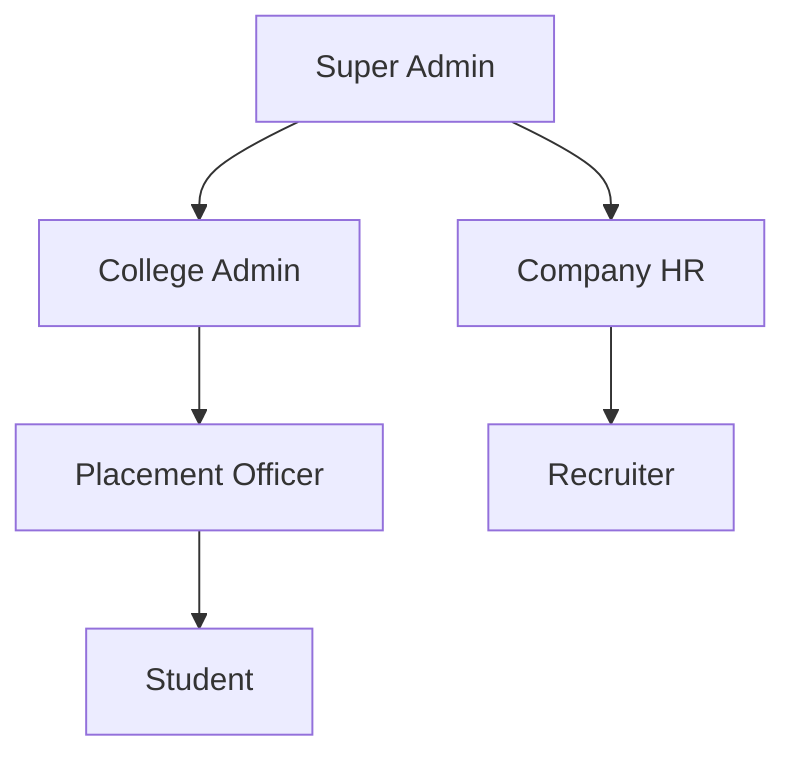

# Role-Based Access Control (RBAC) Specification

## 1. Introduction

**Role-Based Access Control (RBAC)** is a security paradigm that restricts system access based on the predefined roles of individual users within an enterprise. Instead of assigning permissions to every individual user, permissions are grouped into specific roles, and users are assigned those roles based on their organizational responsibilities.

### Why it is important
In enterprise SaaS platforms, RBAC is critical for enforcing security policies, ensuring compliance, minimizing the risk of unauthorized data exposure, and simplifying administrative overhead when managing thousands of users.

### Why SkillSync needs it
SkillSync operates as a Multi-Tenant AI Career Intelligence Ecosystem serving a diverse set of users across multiple independent institutions. It handles highly sensitive Personally Identifiable Information (PII), academic records, and corporate data. A strict RBAC implementation ensures that students only see their own data, colleges cannot view other colleges' placement metrics, and recruiters interact only with candidates eligible for their jobs.

---

## 2. Role Hierarchy

*Note: The hierarchy implies a conceptual span of control, not necessarily absolute permission inheritance. For instance, a College Admin manages Students, but does not inherently possess the right to impersonate a Student.*

---

## 3. Permission Categories

To ensure granular security, permissions are divided into the following domain categories:

- **Authentication:** Login, password resets, session management.
- **College Management:** Creating colleges, managing college settings, branding, domains.
- **Student Management:** Creating, updating, verifying, and viewing student profiles.
- **Company Management:** Creating corporate profiles, updating company details.
- **Recruitment:** Posting jobs, tracking applications, shortlisting, updating statuses.
- **Resume:** Uploading, updating, and viewing resumes.
- **AI:** Triggering AI resume analysis, viewing ATS scores, analyzing skill gaps.
- **Reports:** Generating and downloading operational reports.
- **Analytics:** Viewing dashboards and placement metrics.
- **Notifications:** Sending and receiving system alerts and emails.
- **Settings:** Managing personal profiles and security preferences.

---

## 4. Permission Matrix

| Permission | Super Admin | College Admin | Placement Officer | Student | Company HR | Recruiter |
| :--- | :---: | :---: | :---: | :---: | :---: | :---: |
| **Authentication** | | | | | | |
| Login / Logout | ✅ | ✅ | ✅ | ✅ | ✅ | ✅ |
| Manage Own Password | ✅ | ✅ | ✅ | ✅ | ✅ | ✅ |
| **College Management** | | | | | | |
| Create/Delete College Tenant | ✅ | ❌ | ❌ | ❌ | ❌ | ❌ |
| Manage Tenant Settings | ❌ | ✅ | ❌ | ❌ | ❌ | ❌ |
| **Student Management** | | | | | | |
| View Global Student List | ✅ | ❌ | ❌ | ❌ | ❌ | ❌ |
| View College Student List | ❌ | ✅ | ✅ | ❌ | ❌ | ❌ |
| Verify Student Profile | ❌ | ❌ | ✅ | ❌ | ❌ | ❌ |
| Edit Own Profile | ❌ | ❌ | ❌ | ✅ | ❌ | ❌ |
| **Company Management** | | | | | | |
| Create Company Profile | ✅ | ❌ | ❌ | ❌ | ✅ | ❌ |
| Manage Company Details | ❌ | ❌ | ❌ | ❌ | ✅ | ❌ |
| Add/Remove Recruiters | ❌ | ❌ | ❌ | ❌ | ✅ | ❌ |
| **Recruitment** | | | | | | |
| Post a Job | ❌ | ❌ | ❌ | ❌ | ✅ | ✅ |
| Approve Job Posting | ❌ | ❌ | ✅ | ❌ | ❌ | ❌ |
| Apply for Job | ❌ | ❌ | ❌ | ✅ | ❌ | ❌ |
| View Applicants for Job | ❌ | ❌ | ✅ | ❌ | ➖ | ➖ |
| Update Applicant Status | ❌ | ❌ | ❌ | ❌ | ➖ | ➖ |
| **Resume & AI** | | | | | | |
| Upload Resume | ❌ | ❌ | ❌ | ✅ | ❌ | ❌ |
| View Own AI Insights | ❌ | ❌ | ❌ | ✅ | ❌ | ❌ |
| View College AI Insights | ❌ | ✅ | ✅ | ❌ | ❌ | ❌ |
| **Reports & Analytics** | | | | | | |
| Global Analytics | ✅ | ❌ | ❌ | ❌ | ❌ | ❌ |
| College Analytics | ❌ | ✅ | ✅ | ❌ | ❌ | ❌ |
| Company Analytics | ❌ | ❌ | ❌ | ❌ | ✅ | ❌ |

*(Legend: ✅ Allowed | ❌ Not Allowed | ➖ Limited by resource ownership)*

---

## 5. Detailed Role Responsibilities

### 1. Super Admin
- **Purpose:** Total platform oversight, system health, and tenant onboarding.
- **Responsibilities:** Managing SaaS subscriptions, creating new college tenants, and resolving global support tickets.
- **Accessible Modules:** Tenant Management, Global Analytics, Global User Management.
- **Restricted Modules:** Cannot modify student academic records, cannot apply for jobs, cannot alter AI analysis.
- **Business Rules:** Super Admins should not view Student PII directly unless an explicit audit context is provided.

### 2. College Admin
- **Purpose:** Primary authority for a specific educational institution (tenant).
- **Responsibilities:** Managing Placement Officers, configuring college-specific branding, and overseeing overall placement success.
- **Accessible Modules:** College Settings, College Analytics, User Management (Placement Officers).
- **Restricted Modules:** Cannot access any data outside their assigned `tenantId`.
- **Business Rules:** Responsible for the data governance within their institution.

### 3. Placement Officer
- **Purpose:** Operational management of the daily recruitment lifecycle for a college.
- **Responsibilities:** Verifying student academic details, approving job postings for their college, and organizing placement drives.
- **Accessible Modules:** Student Management, Job Approvals, College Analytics, Reports.
- **Restricted Modules:** Cannot modify tenant billing or global platform settings.
- **Business Rules:** Placement Officers can only view and manage students explicitly enrolled in their assigned college.

### 4. Student
- **Purpose:** The primary job seeker and end-user of the AI tools.
- **Responsibilities:** Keeping profile data accurate, uploading resumes, leveraging AI insights to close skill gaps, and applying to eligible jobs.
- **Accessible Modules:** Own Profile, Resume Upload, Job Board, AI Analytics, Job Applications.
- **Restricted Modules:** Cannot view other students' profiles or college-wide analytics.
- **Business Rules:** A student's application actions are strictly limited to their own identity and jobs they are eligible for.

### 5. Company HR
- **Purpose:** Managing the corporate brand presence and recruitment team on the platform.
- **Responsibilities:** Managing the company profile, inviting Recruiters, overseeing hiring metrics across multiple colleges.
- **Accessible Modules:** Company Settings, Recruiter Management, Company Analytics, Job Postings.
- **Restricted Modules:** Cannot view student profiles unless the student has applied or explicitly opted into a global talent pool.
- **Business Rules:** Can manage all jobs and recruiters associated with their specific `companyId`.

### 6. Recruiter
- **Purpose:** Tactical execution of the hiring process for specific roles.
- **Responsibilities:** Posting jobs, reviewing AI-matched candidates, shortlisting applicants, and updating pipeline statuses.
- **Accessible Modules:** Job Postings (Owned), Application Pipelines (Owned).
- **Restricted Modules:** Cannot alter company profile details or manage other recruiters.
- **Business Rules:** Recruiters can only view and modify applications for the specific jobs they have been assigned to or have created.

---

## 6. Resource Ownership

Resource ownership ensures that even if a user has a specific permission (e.g., "Update Application Status"), they can only apply that permission to resources they own.

- **Student Ownership:** A Student owns their profile, their resumes, and their applications. A student is the only user who can directly edit their resume.
- **College Admin Ownership:** A College Admin "owns" the college tenant. They have administrative rights over all Placement Officers and settings within that specific tenant.
- **Company HR Ownership:** A Company HR user owns the Company profile. They control the overarching corporate settings and own all recruitment data associated with that company.
- **Recruiter Ownership:** A Recruiter owns specific Job Postings. They can only transition application states (e.g., Applied -> Shortlisted) for applicants who applied to *their* assigned jobs.

---

## 7. Tenant Isolation Rules

The system is fundamentally partitioned by `tenantId` (representing a College).

- **Strict Boundary:** Users belonging to College A cannot query, view, edit, or interact with any data (Students, Placement Officers, College Analytics) belonging to College B.
- **Data Leak Prevention:** All business operations fetching student or college data must inherently include the `tenantId` in the query payload. 
- **Corporate Cross-Tenancy:** Companies (HR/Recruiters) are the only entities that bridge tenants. A Recruiter can post a job visible to College A and College B, but when viewing applicants, the system ensures the Recruiter only sees data explicitly submitted to them by the students of those respective colleges.

---

## 8. Security Rules

- **Least Privilege:** Users are granted the absolute minimum permissions required to perform their responsibilities. If a Placement Officer only needs to read a report, they are not granted write access.
- **Role Separation:** Distinct boundaries between operational execution (Placement Officer) and configuration (College Admin) prevent conflicts of interest and configuration errors.
- **Need To Know:** Access to sensitive data (like specific AI-identified skill gaps or exact academic marks) is restricted strictly to the Student and the verified Placement Officer. Recruiters only see what is relevant to the job application.
- **Audit:** Any action that modifies data state (approving a job, changing an application status) must be traceable back to the specific user and role that executed it.
- **Sensitive Data:** PII (Personally Identifiable Information) requires enhanced protection. Super Admins are restricted from arbitrary PII access to maintain privacy compliance.

---

## 9. Future Roles

The architecture is extensible to accommodate future user personas without disrupting current operations:

- **Guest:** Non-authenticated or temporary access users for viewing public job fairs or public college placement statistics.
- **Alumni:** Former students possessing limited access to view job boards, offer mentorship, or utilize the AI career tools post-graduation.
- **Faculty:** Academic staff with permissions to view aggregated class performance or skill gap analytics to adjust curriculum, without access to individual student job applications.
- **Mentor:** Industry professionals with permissions to view assigned student profiles strictly for providing career feedback.
- **Training Partner:** Third-party organizations that can view anonymized skill gaps to offer targeted upskilling courses.

---

## 10. Design Decisions

| Decision | Reason |
| :--- | :--- |
| **Explicit Split between Company HR and Recruiter** | Large enterprises require a manager (HR) to control the corporate brand and billing, while individual recruiters (Recruiter) handle the tactical day-to-day candidate pipelines. |
| **College Admin cannot view Global Student List** | Enforces strict Multi-Tenant isolation. A College Admin has zero business need to view students outside their institution. |
| **Super Admin cannot view Tenant Data** | Reduces privacy liability. Super Admins manage the platform infrastructure and subscriptions; they do not need access to individual student resumes or grades. |
| **Placement Officers approve Job Postings** | Colleges need to maintain a standard of quality and protect students from fraudulent or irrelevant job postings. |
| **Students cannot view other Students** | Prevents data scraping and maintains strict academic and professional privacy among peers. |
