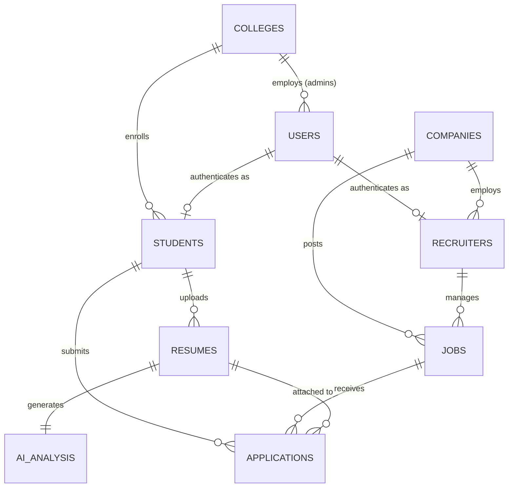

# Database Design Document

## 1. Database Overview

**MongoDB Atlas** is the chosen primary database for SkillSync. Its document-oriented NoSQL structure perfectly complements the rapidly evolving schemas typical in AI-driven applications (e.g., unstructured resume parsing, variable skill taxonomies). Atlas provides fully managed, secure, and highly available clusters with out-of-the-box support for horizontal scaling.

We employ a **Shared Database + Shared Schema Strategy** for multi-tenancy. All colleges (tenants) share the same underlying database and collections. This approach drastically reduces infrastructure costs during the MVP phase and simplifies database migrations, schema updates, and cross-tenant corporate recruiting features.

**Scalability Philosophy:** We design for read-heavy workloads. The data architecture focuses on embedding data that is read together and referencing data that grows infinitely. As the platform scales horizontally, sharding will be introduced using the `tenantId` (College ID) as the shard key to distribute load evenly across clusters.

---

## 2. Database Design Principles

- **Document Design:** Schemas mirror application data access patterns. Data accessed together is stored together.
- **Normalization vs Denormalization:** We selectively denormalize (duplicate) static or rarely changing data (e.g., college name, basic student details inside an application document) to avoid costly `$lookup` (join) operations on high-traffic read paths.
- **Embedded Documents:** Used for bounded, closely related data that doesn't exist independently (e.g., a student's education history or a list of parsed skills inside an AI analysis document).
- **Referenced Documents:** Used for unbounded, growing data or entities that require independent lifecycles (e.g., a Student referencing a College, or an Application referencing a Job).
- **Scalability:** Prevent unbounded array growth. A job document will not contain an array of application IDs; instead, application documents will reference the job ID.
- **Performance:** Indexes are heavily utilized to optimize frequent query patterns. Aggregation pipelines are preferred over in-memory processing.
- **Maintainability:** Strict Mongoose schemas with predefined validation rules enforce data integrity at the application layer.

---

## 3. Collections

### `users`
- **Purpose:** Central authentication and identity collection for all platform users.
- **Owner:** System
- **Relationships:** Referenced by all other entities via `createdBy`/`updatedBy`. 1:1 with `students`, `recruiters`, or `colleges` depending on the role.
- **Business Notes:** Stores only authentication-related data (email, password hash, role). Domain-specific data resides in the respective role collections.

### `colleges`
- **Purpose:** Represents the tenant entity in the multi-tenant architecture.
- **Owner:** Super Admin
- **Relationships:** 1:N with `students`, `jobs` (via company targeting), `users` (Placement Officers).
- **Business Notes:** Contains configuration, branding, and domain settings. Serves as the anchor for data isolation.

### `students`
- **Purpose:** Stores comprehensive academic and professional profiles of job seekers.
- **Owner:** Student
- **Relationships:** 1:1 with `users` (auth). 1:N with `resumes`, `applications`, `ai_analysis`. References `colleges`.
- **Business Notes:** Only the owning student or authorized Placement Officers can modify this data.

### `companies`
- **Purpose:** Stores corporate profiles for organizations recruiting on the platform.
- **Owner:** Company HR
- **Relationships:** 1:N with `recruiters`, `jobs`.
- **Business Notes:** Acts as a cross-tenant entity. A company is not bound to a single college.

### `recruiters`
- **Purpose:** Represents individual hiring managers or talent acquisition staff.
- **Owner:** Company HR
- **Relationships:** 1:1 with `users` (auth). References `companies`. 1:N with `jobs`.
- **Business Notes:** Recruiters operate on behalf of their associated company.

### `jobs`
- **Purpose:** Stores job postings, descriptions, and eligibility criteria.
- **Owner:** Recruiter / Company
- **Relationships:** References `companies`, `recruiters`. 1:N with `applications`.
- **Business Notes:** Jobs can be explicitly targeted to specific `colleges` or remain open globally.

### `applications`
- **Purpose:** Tracks the lifecycle of a student applying for a specific job.
- **Owner:** Student (Submitter) / Recruiter (Manager)
- **Relationships:** References `students`, `jobs`, `resumes`.
- **Business Notes:** Highly transactional. Contains the current status (Applied, Shortlisted, Rejected) and denormalized ATS scores for quick recruiter sorting.

### `resumes`
- **Purpose:** Manages the metadata and storage pointers for uploaded resume files.
- **Owner:** Student
- **Relationships:** References `students`. 1:1 with `ai_analysis`.
- **Business Notes:** Supports versioning. A student can have multiple resumes tailored for different roles.

### `ai_analysis`
- **Purpose:** Stores the structured JSON output generated by Gemini AI after parsing a resume.
- **Owner:** System / Student
- **Relationships:** References `resumes`, `students`.
- **Business Notes:** Separated from the resume collection because AI data is large, complex, and may be regenerated independently of the file upload.

### `notifications`
- **Purpose:** Stores in-app alerts and email triggers.
- **Owner:** Recipient User
- **Relationships:** References `users` (recipient).
- **Business Notes:** Ephemeral data. High volume collection designed to be periodically purged or archived.

### `reports`
- **Purpose:** Stores metadata for asynchronously generated CSV/PDF analytics reports.
- **Owner:** Requesting User
- **Relationships:** References `users`, `colleges`.
- **Business Notes:** Reports can take time to generate; this collection tracks the background job status and download link.

### `activity_logs`
- **Purpose:** Immutable audit trail of critical system actions.
- **Owner:** System
- **Relationships:** References `users` (actor).
- **Business Notes:** Used strictly for security compliance and troubleshooting.

---

## 4. Entity Relationship Diagram

*Note: The diagram illustrates the primary logical relationships. In a shared-database NoSQL architecture, these lines represent document references (e.g., `ObjectId`), not enforced foreign keys.*

---

## 5. Collection Relationships

- **One-to-One (1:1):** 
  - `users` to `students`: Ensures authentication credentials are decoupled from business domain profiles.
  - `resumes` to `ai_analysis`: A specific uploaded file maps exactly to one set of extracted AI insights.
- **One-to-Many (1:N):** 
  - `colleges` to `students`: A college manages thousands of students. Data is strictly referenced to prevent unbounded array growth inside the college document.
  - `jobs` to `applications`: A single job receives hundreds of applications.
- **Many-to-Many (N:M):** 
  - Modeled using intermediate collections or dual-referencing depending on the access pattern. For example, a student applies to many jobs, and a job receives many students. This is resolved via the `applications` collection acting as a transactional join table.

---

## 6. Common Fields

Every business entity collection implements a standard base schema:

- `_id`: (ObjectId) The immutable, universally unique identifier generated by MongoDB.
- `tenantId`: (ObjectId) Reference to the `colleges` collection. Crucial for data isolation.
- `status`: (String) Enum representing the entity's current state (e.g., 'ACTIVE', 'INACTIVE', 'PENDING').
- `createdAt`: (Date) Timestamp of document creation. Automatically managed by Mongoose.
- `updatedAt`: (Date) Timestamp of the last document modification.
- `createdBy`: (ObjectId) Reference to the `users` collection indicating who created the record.
- `updatedBy`: (ObjectId) Reference to the `users` collection indicating who last modified the record.
- `version`: (Number) Internal document version (`__v` in Mongoose) to handle optimistic concurrency control.
- `isDeleted`: (Boolean) Flag indicating if the record is soft-deleted. Default is false.
- `deletedAt`: (Date) Timestamp of when the soft delete occurred.
- `deletedBy`: (ObjectId) Reference to the user who performed the soft delete.

---

## 7. Multi-Tenant Strategy

- **tenantId:** The `tenantId` is functionally equivalent to the `collegeId`. It is embedded into every operational document (Students, Resumes, Applications).
- **Isolation:** The service layer implicitly appends `{ tenantId: req.user.tenantId }` to all database read and write operations.
- **Cross-Tenant Restrictions:** Application logic strictly prohibits modifying or querying a document where the `tenantId` does not match the authenticated session's tenant.
- **Ownership:** While the Super Admin owns the platform, the College Admin has absolute ownership over the data bound to their `tenantId`.
- **Data Security:** This logical separation prevents "data bleeding" between competitor institutions using the same platform.

---

## 8. Index Strategy

Indexes are applied deliberately to balance fast reads against slightly slower writes and memory usage.

- `email` (users): **Unique Index**. Ensures no duplicate accounts and allows rapid login lookups.
- `tenantId` (students, applications, etc.): **Standard Index**. Essential for multi-tenant isolation; virtually all queries filter by this field.
- `companyId` (jobs, recruiters): **Standard Index**. Optimizes queries for HR dashboards.
- `jobId` (applications): **Standard Index**. Accelerates loading the applicant pipeline for recruiters.
- `skills` (students, ai_analysis): **Multikey Index**. Allows recruiters to rapidly search arrays of AI-extracted skills to find matching candidates.
- `status` (jobs, applications): **Standard Index**. Optimizes queries filtering for "Active" jobs or "Shortlisted" applications.
- `createdAt` (notifications, activity_logs): **TTL (Time-To-Live) Index**. Used to automatically purge old logs or notifications after a specific time frame (e.g., 90 days).

---

## 9. Soft Delete Strategy

Data is **never permanently deleted** (hard deleted) via standard API calls.

- **Why:** Accidental deletions in a SaaS platform can be catastrophic. Soft deleting preserves historical context, audit trails, and relational integrity (e.g., a deleted student's past applications remain visible for reporting).
- **Lifecycle:** 
  1. User triggers a delete action.
  2. The system sets `isDeleted: true`, populates `deletedAt`, and records `deletedBy`.
  3. All standard database queries filter out `isDeleted: true` documents by default.
  4. Super Admins can execute a background job to permanently purge soft-deleted data older than 7 years for compliance.

---

## 10. Audit Strategy

Accountability and traceability are enterprise requirements.

- **createdBy / updatedBy:** Every document intrinsically tracks the actor responsible for its current state.
- **Activity Logs:** The `activity_logs` collection tracks critical state transitions (e.g., "Recruiter X changed Application Y status to Rejected").
- **History Tracking:** For highly sensitive fields (like student academic marks), prior values are logged before overwriting, allowing Placement Officers to track unauthorized alterations.

---

## 11. Data Lifecycle

- **Student:** Created during onboarding -> Maintained during academic tenure -> Deactivated/Archived upon graduation.
- **Resume:** Uploaded -> Parsed by AI -> Replaced by newer versions -> Retained for historical application reference.
- **AI Analysis:** Generated post-upload -> Drives matching algorithms -> Immutable unless the source resume is updated.
- **Application:** Created -> Reviewed -> Shortlisted/Interviewed -> Offered/Rejected -> Archived post-placement season.
- **Job:** Drafted -> Approved -> Published -> Receives Apps -> Closed -> Retained for annual college analytics.
- **Notifications:** Triggered by events -> Read by user -> Automatically purged by TTL index after 30 days.

---

## 12. File Storage Strategy

MongoDB is not a file system. Binary data is stored externally.

- **Resume PDFs:** Stored in a secure cloud bucket (e.g., AWS S3). The database only stores the secure URL/URI and metadata.
- **Profile Photos:** Stored via cloud CDN (e.g., Cloudinary) for rapid delivery and automated image optimization.
- **Certificates & Reports:** Stored in secure buckets with time-limited signed URLs to prevent unauthorized public access.
- **Future Cloud Storage:** The database schema is designed to store agnostic `fileUrl` and `provider` fields, allowing seamless migration between AWS, GCP, or Azure blob storage.

---

## 13. Backup Strategy

- **Atlas Backups:** Utilizing MongoDB Atlas continuous cloud backups.
- **Recovery:** Point-in-time recovery (PITR) enabled for production clusters, allowing restoration to any minute within the last 7 days.
- **Disaster Recovery:** Clusters are deployed across multiple availability zones to survive regional data center outages.
- **Retention:** Daily snapshots retained for 30 days; monthly snapshots retained for 1 year for compliance auditing.

---

## 14. Performance Strategy

- **Pagination:** Enforced on all list APIs (e.g., searching students, listing jobs) using limit/skip or cursor-based pagination to prevent memory exhaustion.
- **Filtering & Sorting:** Executed at the database level utilizing compound indexes, never in application memory.
- **Aggregation:** Mongoose `$lookup` and aggregation pipelines are used to compile complex analytical dashboards directly within the database engine.
- **Caching:** Future implementation of Redis will cache read-heavy, slow-changing data (like college configurations or global active job lists).
- **Large Collections:** Collections like `activity_logs` use TTL indexes to prevent infinite vertical growth, ensuring predictable query performance over time.

---

## 15. Future Expansion

The schema architecture is decoupled to support seamless integration of future modules:

- **Coding Assessments / AI Interviews:** Can be added as new collections (`assessments`, `interviews`) that simply reference existing `applications` or `students` via `ObjectId`, requiring zero changes to the core student profiles.
- **Internships:** The `jobs` collection can accommodate internships via a simple `jobType` enum addition, utilizing the exact same application pipeline.
- **Alumni:** Handled by transitioning a student's `status` to "ALUMNI". No new collections are needed, just adjusted RBAC permissions.
- **Training Platform:** New collections (`courses`, `enrollments`) will reference the `skills` identified in the existing `ai_analysis` to recommend targeted learning paths.
